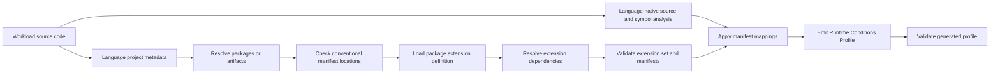

# Generator Discovery and End-User Workflow

## Status

**Non-normative implementation guidance**

This guide documents how first-party generators discover Runtime Conditions metadata from language packages and how an end user benefits from those manifests when generating workload profiles.

---

# 1. Shared Discovery Model

Generators should start from the workload's language-native project model: package manager metadata, build tool configuration, source sets, import resolution, and dependency overrides. They should inspect packages and artifacts that can contribute source-level declarations, SDK mappings, or production library mappings. They should not crawl arbitrary dependency cache directories looking for Runtime Conditions manifests.

Each language profiler should be native to that language's tooling model. Shared behavior belongs in extension definitions, binding/package manifests, dependency resolution, profile validation, and cross-language fixtures. A Go profiler should not parse Java source; a Java profiler should not depend on Go AST behavior.

A generator may discover two manifest types:

- `runtimeconditions.bindings.yaml` maps declarative Runtime Conditions helper APIs to extension-owned vocabulary.
- `runtimeconditions.package.yaml` maps SDK or production library APIs to extension-owned vocabulary.

Both manifest types resolve a `runtimeconditions.extension.yaml` definition, or an explicit vendored or local override path, before their mappings are trusted.

The intended flow is:



This keeps the language package manager as the source of truth for package versions and avoids expensive scans of directories such as `node_modules`, Maven caches, Python virtual environments, or transitive Go module caches.

---

# 2. Common Workflow

The workflow is language-neutral at the package artifact level. Each language implementation should map these steps onto its own resolver and parser:

1. Load the workload project using language-native metadata.
2. Identify imports, packages, modules, or artifacts that may contribute declaration, SDK, or production library mappings.
3. Resolve those packages through the language-native package manager or build tool, including local override rules.
4. Check each resolved package or artifact for `runtimeconditions.bindings.yaml` or `runtimeconditions.package.yaml`.
5. Load each discovered manifest.
6. Load `runtimeconditions.extension.yaml` from the resolved package artifact, or a manifest-referenced vendored/development override.
7. Resolve the direct extension's declared dependency extension identifiers.
8. Validate the cumulative extension definition set and discovered manifests.
9. Analyze workload source using the language's native AST, type, or symbol facilities.
10. Match source usage to manifest mappings.
11. Emit and validate a Runtime Conditions Profile.

Generators do not need a separate extension root for manifests shipped by resolved packages. A development override root is useful only for local extension definitions, fixtures, or repository-local authoring workflows.

---

# 3. Language Resolution

## 3.1 Go

The implemented Go path uses `go.mod`, `go/packages`, and Go import resolution. It resolves imported packages to package directories and checks those directories for Runtime Conditions manifests.

The Go CLI's `-extensions-root` flag is a development override for local extension definitions. Binding and package manifests are still discovered from resolved imports.

The Go profiler currently implements source extraction and profile generation.

## 3.2 Java

The Java profiler should treat Maven and Gradle as first-class package resolution sources.

For Maven, the profiler starts from `pom.xml`, reads reactor modules, resolves the selected classpath through `./mvnw` or `mvn`, and inspects the resulting module output directories and dependency JARs.

For Gradle, the profiler starts from `settings.gradle`, `settings.gradle.kts`, `build.gradle`, or `build.gradle.kts`, reads included projects, resolves the selected source set or configuration through `./gradlew` or `gradle`, and inspects the resulting project outputs and dependency JARs.

Published Java packages should expose Runtime Conditions metadata as classpath resources:

```text
META-INF/runtimeconditions/runtimeconditions.bindings.yaml
META-INF/runtimeconditions/runtimeconditions.package.yaml
META-INF/runtimeconditions/runtimeconditions.extension.yaml
```

At source time, those files usually live under:

```text
src/main/resources/META-INF/runtimeconditions/
```

During repository-local development, the Java profiler may also accept package-root manifests as a convenience:

```text
runtimeconditions.bindings.yaml
runtimeconditions.package.yaml
runtimeconditions.extension.yaml
```

The current Java profiler slice implements Maven, Gradle, and source-only project detection; Maven reactor module discovery; Gradle included-project discovery; build-tool classpath resolution when requested; Runtime Conditions artifact discovery from source resources, build output, resolved classpath entries, explicit classpath entries, JAR files, and repository-local package roots; profile generation from declarative `RuntimeConditionsBinding` Java calls; and executable JAR packaging.

Java profile extraction uses Java-native parsing and symbol analysis. The current declarative binding extractor handles ordinary imported declaration classes, wildcard imports, static imports, fully qualified declaration calls, enum constants, cross-file string constants, class literals such as `Todo.class`, schema classes in separate source files, nested option calls, Maven and Gradle source sets, and multi-module source discovery. Overloaded-method disambiguation beyond the manifest-declared method name, richer generic schema modeling, and SDK/runtime package extraction are future work.

## 3.3 Python

The implemented Python path uses `pyproject.toml`, explicit package paths, and Python source/package directories. It resolves local package paths from `tool.runtimeconditions.package-paths`, optional uv path sources, Poetry path dependencies, and direct local references where present. It then inspects only the resolved project and package roots for Runtime Conditions artifacts.

The Python profiler currently implements source extraction and profile generation from declarative `RuntimeConditionsBinding` Python calls. It handles ordinary imports, aliased imports, wildcard imports, fully qualified calls, enum-like constants, cross-file string constants, nested option calls, type/class arguments, schema classes in separate source files, unused imported extension packages, dependency closure validation, and generated profile validation.

The Python profiler supports repository-local package-root manifests:

```text
runtimeconditions.bindings.yaml
runtimeconditions.package.yaml
runtimeconditions.extension.yaml
```

SDK/runtime package extraction and wheel-installed metadata discovery beyond resolved source/package roots are future work.

---

# 4. Go Demo Walkthrough

The current request logger demo imports explicit first-party declaration packages:

```go
import (
	common "github.com/runtimeconditions/extensions/common-integrations/go"
	env "github.com/runtimeconditions/extensions/env-configuration/go"
)
```

The workload declares an HTTP API and Redis cache:

```go
common.API("todos-api",
	common.Spec("openapi", "catalog://api/default/todos-api", "1.0.0"),
	common.GET("/todos/{id}", common.Response[Todo]()),
	env.Env("baseUrl", "TODOS_API_URL"),
)

common.Cache("request-cache",
	common.KeyValue(common.Redis),
	env.EnvAlternative(env.Env("url", "REDIS_URL")),
	env.EnvAlternative(
		env.Env("hostname", "REDIS_HOST"),
		env.Env("port", "REDIS_PORT"),
	),
)
```

Running the Go generator:

```sh
cd go-rc-profiler
go run . \
  -dir ../rc-demos/apps/request-logger-http \
  -name request-logger-http \
  -workload-uri github.com/runtimeconditions/rc-demos/apps/request-logger-http \
  -workload-version v0.1.0
```

produces a profile that includes the directly used declaration package extensions:

```yaml
extensions:
  - https://runtimeconditions.io/extensions/common-integrations/v1alpha1/runtimeconditions.extension.yaml
  - https://runtimeconditions.io/extensions/env-configuration/v1alpha1/runtimeconditions.extension.yaml

conditions:
  - name: todos-api
    kind: api
    interface:
      type: http
    configuration:
      env:
        - property: baseUrl
          name: TODOS_API_URL
  - name: request-cache
    kind: cache
    interface:
      type: key_value
      engine: redis
    configuration:
      alternatives:
        - env:
            - property: url
              name: REDIS_URL
        - env:
            - property: hostname
              name: REDIS_HOST
            - property: port
              name: REDIS_PORT
```

The `todos-api` and `request-cache` Conditions come from explicit first-party declaration package calls in the workload. A workload that also imports an SDK or production library package with a manifest can emit additional package-discovered Conditions from that source usage.

The profile records the environment variable names expected by the workload. It does not contain the values for those variables. In the Kratix demo, the `ApplicationRelease` Promise resolver maps these requested properties to platform-owned outputs:

| Condition property | Kubernetes source |
| ---- | ---- |
| `baseUrl` | Literal service URL from the API catalog |
| `url`, `hostname`, `port` | Redis service address rendered from the generated Redis request |

The resolver applies platform context in two steps:

- API Conditions are validated against the catalog OpenAPI document before the workload Deployment is emitted.
- Redis cache Conditions emit a `Redis` request and bind the generated service address into the workload environment.

The generator still emits only the Runtime Conditions Profile. `ApplicationRelease` resolution and Kubernetes resources are adapter output.

---

# 5. Extension Dependency Resolution

Package manifests identify the extension used by generated Conditions with `extension.id`:

```yaml
extension:
  id: https://aws.example.com/runtimeconditions/object-store/v1alpha1/runtimeconditions.extension.yaml
```

Binding manifests use `metadata.extension` for the same purpose.

The extension definition declares its dependencies:

```yaml
spec:
  dependencies:
    - https://runtimeconditions.io/extensions/common-integrations/v1alpha1/runtimeconditions.extension.yaml
    - https://runtimeconditions.io/extensions/env-configuration/v1alpha1/runtimeconditions.extension.yaml
```

Generators and validators should resolve the direct extension definition from the resolved code package whenever possible. They then resolve dependency extension identifiers from configured sources such as package-local artifacts, local caches, organization registries, public registries, or development roots.

Extensions are standalone artifacts. A workload or adapter can use an extension without using the SDK or production library that originally motivated it. Packages that participate in generation must reference an extension definition from their manifest; they do not define vocabulary inside the manifest itself.

Packages do not need to physically include every transitive dependency extension file. Dependencies are resolved from exact extension identifiers after the package-owned extension definition is loaded.

---

# 6. End-User Workflow

An application developer using third-party SDK or production library support should be able to follow this workflow:

1. Add or update the dependency as usual.
2. Write normal application code against the SDK or production library.
3. Add explicit Runtime Conditions declarations only for unsupported packages, raw HTTP calls, or app-specific integrations.
4. Run the language generator.
5. Review the generated Runtime Conditions Profile.
6. Validate the profile against the core spec and resolved extensions.
7. Pass the validated profile to an adapter or platform workflow.

The end user should not need to add a separate application config file just to enable package-based Condition discovery.

---

# 7. Diagnostics

Generators SHOULD produce actionable diagnostics for malformed package metadata.

Examples:

| Case | Diagnostic Category |
| ---- | ------------------- |
| Imported package has malformed `runtimeconditions.bindings.yaml` | `package-manifest` |
| Imported package has malformed `runtimeconditions.package.yaml` | `package-manifest` |
| Manifest references a missing extension file | `package-extension` |
| Manifest references an unsupported language section | `package-language` |
| Manifest maps a method that cannot be matched statically | `package-mapping` |
| Extension dependency cannot be resolved | `extension-dependency` |
| Generated vocabulary is not defined by resolved extensions | `unresolved-vocabulary` |

Generators SHOULD NOT fail merely because an imported package does not include a Runtime Conditions manifest. Most libraries will not participate in this convention.

Generators SHOULD fail before emitting a profile when a discovered manifest is malformed or would emit unresolved vocabulary.

---

# 8. Dedupe and Aggregation

A generator may see the same SDK or production library method called many times.

Package manifests SHOULD choose stable Condition names so generators can deduplicate repeated calls.

Example:

```yaml
declarations:
  - receiver: Client
    method: PutObject
    name: s3-object-store
    kind: aws.object_store
    interfaceType: aws.s3
```

If a workload calls `PutObject` in five places, the generated profile should normally contain one `s3-object-store` Condition unless the manifest defines a static and safe way to distinguish multiple integration requirements.

---

# 9. Unsupported Integrations

Package manifest discovery is additive. It does not replace explicit declarations.

For raw HTTP calls, SDKs, or production libraries without package manifests, developers can still write explicit declarations:

```go
common.API("todos-api",
	common.Spec("openapi", "catalog://api/default/todos-api", "1.0.0"),
	common.GET("/todos/{id}", common.Response[Todo]()),
)
```

This preserves a practical escape hatch while allowing richer packages to surface their internal Conditions automatically.
