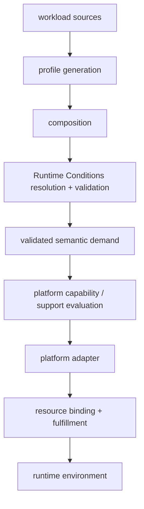
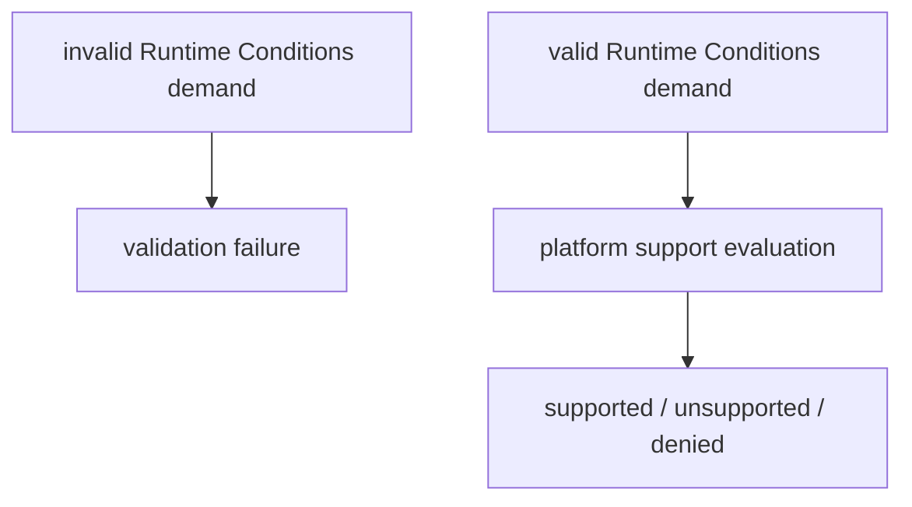
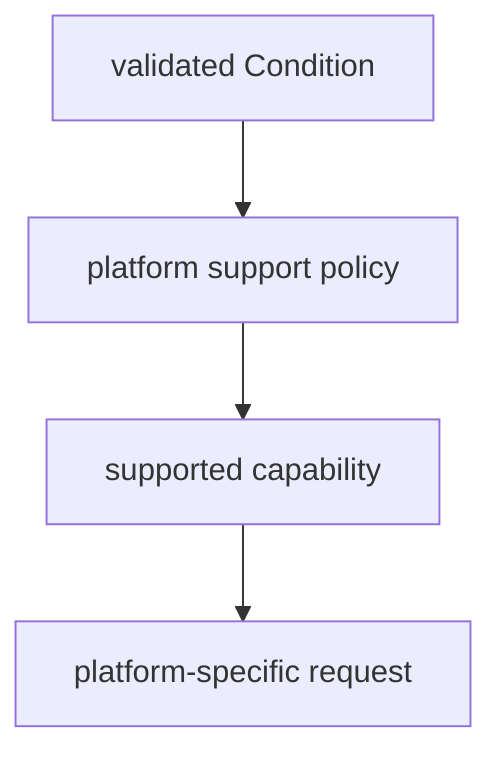
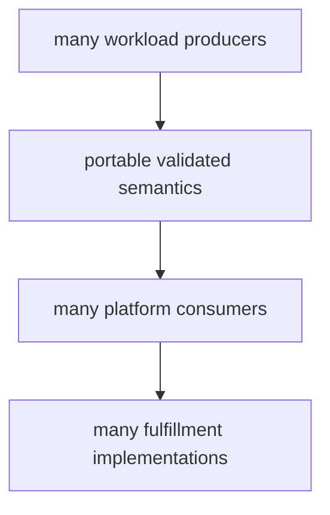
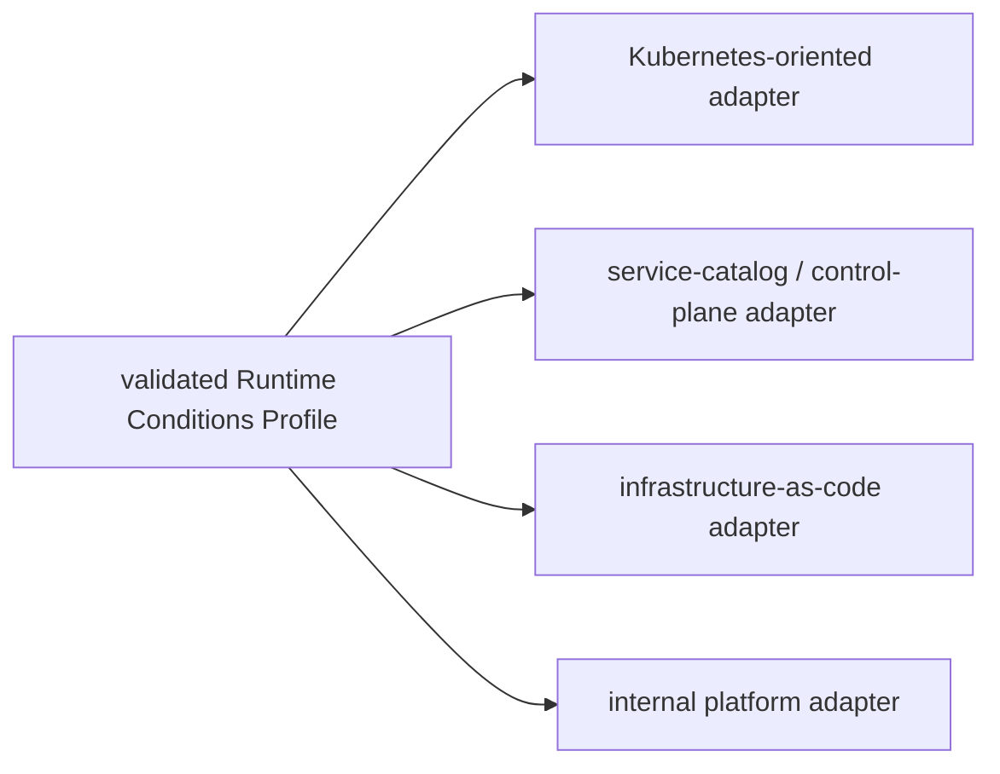

# Scalable Runtime Conditions Consumption Architecture

# 1. Scope

The Runtime Conditions white paper already establishes the core model: workloads express portable runtime demand, extensions provide vocabulary, Profiles are generated and validated, and platform adapters map valid demand to environment-specific fulfillment.

This note starts from that model and asks a narrower question:

> What boundaries are required so Profile production, composition, validation, platform capability matching, and fulfillment can evolve independently without creating pairwise integrations between every workload and every platform?

See the [Runtime Conditions white paper](../runtime-conditions-whitepaper-draft.md).

# 2. Candidate scalable architecture

The important part of this diagram is not the individual boxes. It is the ownership boundary between them. Runtime Conditions should provide a portable semantic contract; downstream platforms should decide what they support and how that support becomes concrete resources.

# 3. Boundaries that matter

## 3.1 Composition and lifecycle are upstream concerns

A workload Profile may be assembled from application code, package or SDK metadata, framework metadata, development-environment definitions, or other generators. Those inputs need a lifecycle and a composition point before platform-specific fulfillment begins.

Current discussion suggests CI is a natural orchestration point when these sources live with the workload, but this is still an open architecture area. The key constraint is that a platform adapter should consume coherent workload demand rather than recreate source analysis or fragment composition itself.

## 3.2 Runtime Conditions validity is not platform support

A Profile can be valid Runtime Conditions and still request something a particular platform does not support.

Keeping these decisions separate lets Runtime Conditions remain portable while allowing platforms to expose explicit support boundaries. It also produces better failure semantics: an invalid Profile is different from valid demand that a target platform cannot or will not fulfill.

## 3.3 Validated vocabulary is the downstream semantic contract

The architecture discussion clarified that downstream interpretation should primarily key on the visible Condition vocabulary, not hidden meaning associated with an extension identity.

- Semantic distinctions should be expressed in vocabulary, using namespacing when the meaning is vendor-specific, platform-specific, experimental, or likely to conflict.
- After validation, an adapter should not normally need the extension artifact itself to recover what a Condition means.
- A platform may use extension identity for a concrete special case, but identity-aware dispatch is not the default contract.

This keeps the validation boundary small: the validated Profile remains the portable semantic artifact instead of requiring a second normalized or provenance-enriched Profile solely for downstream dispatch.

## 3.4 Platform capability matching is the supply-side boundary

The platform must answer a different question from the validator: given valid workload demand, what does this platform support here?

This is where the existing CapabilityCatalog concept becomes important. Runtime Conditions defines demand; a platform-owned catalog, policy, provider system, or equivalent mechanism defines supply.

The representation of that support policy does not need to be standardized by Runtime Conditions. Different platforms may already use service catalogs, compositions, promises, modules, resource types, provider APIs, or internal control planes.

The architectural requirement is explicit coverage: valid demand must not silently disappear because a platform does not understand or support part of a Condition.

## 3.5 Concrete resource identity enters at binding and fulfillment

Portable demand should normally stop before target-specific resource identity. Once a platform has accepted a capability request, it can bind that request to the concrete environment.

That downstream binding may decide:

- which resource instance to use or create;
- account, project, region, cluster, or tenant;
- resource names and identifiers;
- identity and authorization mechanisms;
- credential or secret delivery;
- network placement, scale, compliance, cost, and availability policy;
- the provisioning technology and resource lifecycle.

If the workload intrinsically depends on a specific named resource, that is part of demand. Otherwise, choosing the concrete resource is a platform responsibility.

# 4. Why these boundaries scale

These boundaries avoid a matrix of bespoke workload-to-platform integrations.

- Generators and SDKs can evolve without knowing every target platform.
- Extensions can grow the vocabulary without continuously expanding the core specification.
- Platforms can change support policy or fulfillment technology without requiring the workload to change its portable demand.
- Fulfillment implementations remain replaceable because their target-specific choices begin after the portable semantic boundary.
- Unsupported demand remains visible instead of degrading silently.

# 5. Findings from implementation work

Prototype and integration work has been useful mainly because it forced these boundaries to become concrete. The architectural findings, stated without relying on prototype-specific terminology, are:

- Real composed Profiles require an explicit platform-support boundary; a platform will not necessarily fulfill every valid Condition.
- Extension-defined fields can survive generation and validation as opaque semantic data and still be interpreted later by bounded platform policy.
- Invalid semantic vocabulary can fail before platform interpretation, while valid-but-unsupported demand can fail independently at the platform boundary.
- Portable demand can remain independent of concrete cloud resources and credentials while a downstream system binds the request and supplies narrowly scoped runtime authority.
- There is no current evidence that every adapter needs extension-ID-aware dispatch when semantic distinctions can be represented in visible namespaced vocabulary.

# 6. Open architecture questions

The implementation work resolved several boundary questions, but it also makes the remaining ones easier to state:

- Who owns Profile composition and lifecycle when demand comes from multiple sources?
- What is the canonical artifact passed from generation/composition into validation and then to platform consumers?
- How should a consumer know that the Profile it receives has completed the expected resolution and validation steps when those steps happen in another process or system?
- How should optional Conditions affect capability matching and partial fulfillment?
- Would a small common result model for invalid, unsupported, denied, and fulfillment-failed outcomes improve interoperability?
- How should Profile and extension evolution interact with long-lived platform support policy?
- Which parts of this lifecycle belong in local development, CI, deployment, or a continuously running platform control plane?

These questions appear to be the next useful design work. None currently requires introducing another core Runtime Conditions resource type.

# 7. Architectural test

A useful falsifiability test is whether the same validated Profile can be consumed by substantially different platform implementations without changing the workload's semantics.

If the Profile must change merely because the fulfillment technology changed, platform choices are probably leaking back across the portable-demand boundary.

# 8. Non-goals

- Re-specifying the Runtime Conditions Profile or extension model already covered by the white paper and specification.
- Defining a universal platform service catalog.
- Defining one mandatory adapter policy language.
- Defining a universal provisioning system.
- Making any prototype implementation part of the Runtime Conditions architecture.
- Encoding target resource identity or credentials in portable demand unless they are intrinsic workload requirements.

# 9. Implementation evidence and references

The architecture above is intended to stand on its own. The following projects are useful as source material and implementation evidence, not prerequisites for understanding the design.

- [Runtime Conditions white paper](../runtime-conditions-whitepaper-draft.md) — the broader motivation, model, Profile shape, extensions, tooling, and use cases.
- [Runtime Conditions specification](https://github.com/runtimeconditions/spec)
- [rc-demos](https://github.com/runtimeconditions/rc-demos) — runnable Runtime Conditions examples used to exercise real composed Profiles and platform-consumption scenarios.
- [rc-pade](https://github.com/After-Certainty/rc-pade) — an experimental downstream Runtime Conditions adapter used to explore validation, capability matching, binding, and fulfillment boundaries.
- [PADE](https://github.com/After-Certainty/pade) — one capability-oriented authorization and credential-delivery system used as a downstream fulfillment implementation in that work. It is an example consumer/fulfillment mechanism, not part of Runtime Conditions.
- [Architecture discussion](https://github.com/orgs/runtimeconditions/discussions/1)
- [CapabilityCatalog concept](../core/capability-catalog-concept.md)
