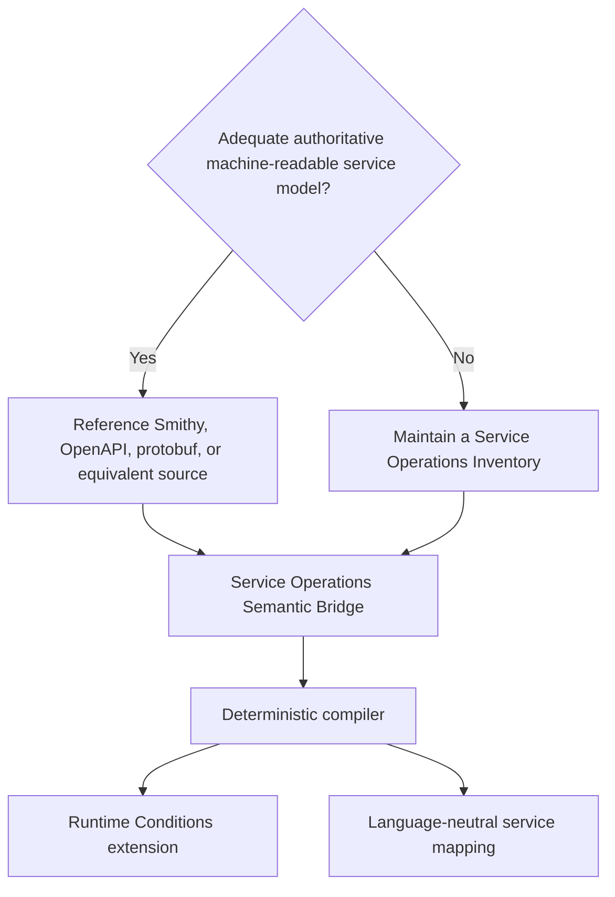

# Service Operation Authoring Guide

## Status

**Non-normative implementation guidance**

This guide explains how an authoritative service model or fallback Service Operations Inventory, a Service Operations Semantic Bridge, a Runtime Conditions extension, and a generated service mapping work together. It is intended for service owners, extension authors, SDK maintainers, generator implementers, and reviewers.

The most important rule is simple: **do not create a Service Operations Inventory when an adequate authoritative machine-readable service model already exists.** An inventory is the last-resort operation authority, not a required layer in every Runtime Conditions integration.

---

# 1. The Relationship at a Glance

Every operation-oriented integration begins by selecting exactly one language-neutral operation authority.



The four artifacts do not form a stack that every runtime consumer loads. They divide authoring responsibilities:

| Artifact | Required? | Authored or generated? | Primary responsibility | Primary consumer |
| --- | --- | --- | --- | --- |
| Service Operations Inventory | Only when no adequate authoritative model exists | Authored or independently generated service artifact | Describe language-neutral service operations, inputs, and service-domain shapes without Runtime Conditions semantics | Semantic bridge compiler and other service tooling |
| Service Operations Semantic Bridge | Yes for this operation-oriented workflow | Small reviewed Runtime Conditions authoring artifact | Translate service operations and inputs into adapter-actionable Condition semantics | Extension and service-mapping compiler |
| Runtime Conditions extension | Yes | Deterministically generated when the bridge is complete | Define and validate the portable Condition vocabulary used in profiles | Profile generators, validators, adapters, and other profile consumers |
| Runtime Conditions service mapping | Yes for SDK mapping generation | Deterministically generated | Record canonical operation-to-Condition translations with exact source, bridge, and extension identity | Language-specific SDK mapping generators and validation tooling |

The extension and service mapping are siblings generated from the same reviewed semantics. The service mapping is not a layer inside the extension, and the extension does not contain a paper trail back to the operation source.

---

# 2. Step One: Select the Operation Authority

## 2.1 Preferred path: an authoritative provider model

Use a provider-maintained machine-readable source when it adequately identifies stable service operations and the inputs needed to interpret them. Examples include:

- Smithy service models
- OpenAPI descriptions
- Protobuf service definitions
- Protocol schemas or comparable provider-maintained models

The semantic bridge references the authoritative artifact directly, including the repository or publication location, model path or identity, and the fingerprints needed for reproducible generation and drift detection. Do not copy the complete operation list into another maintained YAML file merely to make it look like an inventory.

Amazon S3 follows this path. Its semantic bridge references AWS's public Smithy model. Kubernetes also follows this path: its bridge references the authoritative Kubernetes OpenAPI document. A deterministic normalized OpenAPI build projection may be cached for generation, but that cache is not a maintained Service Operations Inventory and is not the semantic authority.

## 2.2 Last-resort path: a Service Operations Inventory

Create `service-operations-inventory.yaml` only when no adequate authoritative machine-readable source exists. Before creating one, confirm that provider models, protocol schemas, generator inputs, and other upstream machine-readable sources cannot supply a stable operation authority.

The inventory should describe service-owned facts that remain meaningful across SDK languages:

- Stable service operation names
- Service resources and actions, when those are part of the service's own domain
- Operation inputs and whether the service requires them
- Service-domain value shapes and constraints
- References to the upstream protocol, server, or documentation sources used to maintain the inventory

The inventory must not contain:

- Runtime Conditions extension identifiers or versions
- Condition kinds, interface types, or profile emission rules
- Adapter policy or provisioning decisions
- SDK packages, modules, classes, methods, arguments, or call graphs
- Programming-language-specific behavior
- Profiler coverage, unresolved observations, or organizational enforcement policy

An inventory should define a coherent service scope rather than record whichever methods happened to appear in the first SDK examined. If the inventory is intentionally incomplete, its documentation must state that boundary; completeness must not be implied by a generated operation count.

NATS currently follows this fallback path. Its inventory is maintained in the separate `runtimeconditions/service-operations-inventories` repository so neutral service facts do not become Runtime Conditions extension semantics by location or convention.

---

# 3. Step Two: Author the Semantic Bridge

The Service Operations Semantic Bridge answers: **What adapter demand does a particular service operation prove?**

The bridge always references the selected operation authority. Its `operationSource.kind` makes the source path explicit:

```yaml
operationSource:
  kind: SmithyModel
  repository: https://github.com/aws/api-models-aws.git
  path: models/s3/service/2006-03-01/s3-2006-03-01.json
  serviceShape: com.amazonaws.s3#AmazonS3
```

```yaml
operationSource:
  kind: OpenAPIDocument
  repository: https://github.com/kubernetes/kubernetes.git
  path: api/openapi-spec/swagger.json
```

```yaml
operationSource:
  kind: ServiceOperationsInventory
  name: nats.service
  service: nats
  semanticSha256: 0f6fb3a7c5f1f3c8c780724057ef96ca22a7b2d0c2766f493e22d5f444c88ee8
```

The remainder of the bridge records only Runtime Conditions translation decisions that cannot be inferred safely from the source. Depending on the service, these decisions can include:

- Which Condition kind and interface type represent the demand
- Whether several service operations share one adapter-facing capability
- Which source action becomes which Condition action or verb
- Which operation input supplies a Condition field
- Whether a Condition field is required or optional
- Whether one operation proves multiple Conditions
- Resource identity paths, roles, scopes, or other adapter-actionable distinctions

The bridge must not repeat SDK symbols or copy a full Smithy, OpenAPI, protobuf, or inventory document. It is deliberately smaller than the operation source and normally much smaller than generated extension or SDK mapping artifacts.

The bridge is a review surface. Humans approve what an operation proves; the compiler proves that the referenced operations and inputs exist and expands those decisions consistently.

---

# 4. Step Three: Generate the Extension

The Runtime Conditions extension is the standalone portable vocabulary and validation contract. It defines which Conditions profiles may contain, not how the authoring team discovered those semantics.

An operation-oriented compiler can generate the extension from the selected operation source plus the semantic bridge when the bridge contains every required adapter-facing decision. Generation can safely perform repetitive work such as:

- Expanding allowed operation or capability values
- Building JSON Schema validation branches
- Ensuring required and optional fields match each Condition form
- Generating interface types and field-value definitions
- Computing immutable semantic digests
- Rejecting bridge references that no longer resolve against the authoritative source

Generation does not decide what an operation should mean. It turns reviewed meaning into complete, deterministic validation artifacts.

The published extension does not need to identify the Smithy file, OpenAPI document, inventory operation, semantic bridge, or SDK method that produced a Condition. A profile validator or platform adapter needs the Condition vocabulary and validation rules, not the authoring paper trail.

Extensions that are not operation-oriented may not need a semantic bridge at all. For example, an environment-configuration extension can be authored directly when no external service-operation source is involved.

---

# 5. Step Four: Generate the Service Mapping

The service mapping is the language-neutral join between service operations and the generated extension. It records the canonical translation needed by SDK mapping generators without putting that authoring information into the extension itself.

A service mapping normally contains:

- The canonical service identity
- Exact extension identifier, version, and semantic digest
- Source and semantic-bridge digests
- Stable service operation names
- One or more Condition templates for each mapped operation
- Required and optional bindings from operation inputs into Condition fields
- Generated service resource lookup data when a language integration needs it

The service mapping is generated output and should not be reviewed line by line. Reviewers inspect the semantic bridge, a focused change summary, representative Condition examples, and adapter impact.

Language-specific SDK mapping generators consume the service mapping and add only SDK-owned information: public symbols, parameter locations, typed state, wrappers, delegation, and release identity. A profiler may consume a self-contained SDK mapping in which the required service operation records have been sealed at build time; the application developer should not be required to locate or configure the service mapping.

A platform adapter does not ordinarily need the service mapping at runtime. It consumes the generated profile and the extension vocabulary, then applies its own implementation and policy. The service mapping may still be useful to adapter authors for build-time permission-table generation, conformance tests, and semantic review.

---

# 6. End-to-End Example: NATS Publish

NATS uses the fallback inventory path because this experiment has not yet identified one adequate authoritative machine-readable operation model for the selected service scope.

## 6.1 Neutral inventory fact

The inventory declares a stable service operation and its service-owned input:

```yaml
operations:
- name: subject.publish
  resource: subject
  action: publish
  inputs:
    subject:
      shape: nats.subject
      required: true
```

This does not create a Runtime Conditions `nats` kind or require that a profile contain `resource`, `action`, or `subject`. It only states what the service operation is.

## 6.2 Reviewed bridge decision

The NATS semantic bridge translates that service operation into a Condition form:

```yaml
extension:
  id: https://runtimeconditions.io/extensions/nats-service/0.1.0/runtimeconditions.extension.yaml
  version: 0.1.0
  conditionKind: nats
  interfaceType: service

operationMappings:
- operation: subject.publish
  condition:
    resource: subject
    action: publish
  bindings:
    subject:
      input: subject
      required: true
```

This is the human-reviewed assertion that publishing to a subject proves a NATS service demand with publish authorization for the source-proven subject.

## 6.3 Generated extension result

The compiler generates extension vocabulary and validation that accept a `nats` service Condition containing the exact publish form and require its `subject` field. Other NATS operations receive their own validation branches rather than becoming arbitrary resource/action/parameter combinations.

## 6.4 Generated service-mapping result

The same compiler generates the canonical operation record:

```yaml
operations:
- name: subject.publish
  conditions:
  - kind: nats
    interfaceType: service
    operation:
      resource: subject
      action: publish
    bindings:
      required:
      - subject
      optional: []
```

## 6.5 SDK mapping and application result

A NATS Python mapping can then state that `Client.publish` reaches `subject.publish` and that the SDK method's `subject` argument supplies the required binding. A Go mapping can point `Conn.Publish` to the same service operation while using Go-specific argument information. Neither SDK redefines what `subject.publish` means.

When application source proves `subject="orders.created"`, the profiler can emit:

```yaml
name: nats-orders
kind: nats
interface:
  type: service
  operations:
  - resource: subject
    action: publish
    subject: orders.created
```

The application developer wrote ordinary SDK code. They did not author an inventory, bridge, service mapping, or SDK mapping.

---

# 7. Change Propagation

Each artifact changes for a different reason. Treating them as one versioned document would create unnecessary maintenance and couple unrelated owners.

| Change | Operation authority | Semantic bridge | Extension | Service mapping | Affected SDK mapping |
| --- | --- | --- | --- | --- | --- |
| Source formatting or metadata changes without semantic change | Updated upstream or inventory serialization | No semantic edit | Unchanged | Provenance may regenerate | Only if SDK source also changed |
| New source operation maps to existing Condition vocabulary | Adds operation | Add or approve translation when required by bridge style | Unchanged if vocabulary and validation are unchanged | Regenerate | Regenerate for every SDK release that exposes the operation |
| Existing operation changes which demand it proves | May change | Review and update translation | Revise only if Condition vocabulary or validation changes | Regenerate | Regenerate and validate affected SDK mappings |
| New adapter-facing distinction is required | May be unchanged | Add the reviewed distinction | Revise and version | Regenerate against the new extension | Regenerate compatible SDK mappings |
| SDK adds or renames a method for an existing service operation | Unchanged | Unchanged | Unchanged | Unchanged | Regenerate that SDK mapping |

The second row is especially important: **extension unchanged does not mean SDK mapping unchanged.** A new SDK method still needs a language-specific mapping to the canonical service operation and existing Condition.

Some extensions deliberately include canonical operation names as adapter-facing vocabulary. Amazon S3 does this because operation names can affect authorization, so a new S3 operation normally changes the extension. Kubernetes and NATS can map multiple source operations to existing verbs or capabilities when no new adapter distinction is needed. Whether the extension changes depends on its adapter-actionable vocabulary, not on a universal rule that every new API operation creates a new Condition value.

---

# 8. Ownership and Review Responsibilities

## Service or protocol owner

- Publishes the authoritative model when possible.
- Reviews or maintains a fallback inventory only when necessary.
- Confirms stable operation names, inputs, and service-domain meaning.

## Extension author and adapter stakeholders

- Author and review the semantic bridge.
- Apply the adapter-actionable minimum.
- Decide whether a source distinction changes portable fulfillment, authorization, policy, configuration, or provisioning.
- Review and version the extension when its public vocabulary changes.

## Runtime Conditions generator maintainers

- Validate exact source and bridge references.
- Generate deterministic extension and service-mapping artifacts.
- Produce focused semantic reviews and drift diagnostics.
- Never ask maintainers to inspect complete generated operation tables line by line.

## SDK maintainers

- Map the SDK's public surface to canonical service operations.
- Maintain SDK-only wrappers, aliases, arguments, state flow, and delegation that cannot be generated from existing SDK models.
- Regenerate mappings for affected SDK releases when service mappings or SDK surfaces change.
- Do not reproduce service semantics in each programming language.

## Application developers

- Use the SDK normally.
- Run the profiler locally or in CI.
- Review the generated profile when desired.
- Use extension-provided declarations or project-local overrides only when static detection cannot prove a required Condition.

## Platform adapter authors

- Consume profiles and extension definitions.
- Implement provisioning, authorization, configuration, validation, or governance for the extension vocabulary.
- Use service mappings for build-time assistance only when useful; do not require application developers to supply authoring artifacts at deployment time.

---

# 9. Repository and Filename Convention

```text
service-operations-inventories/
  <service>/
    service-operations-inventory.yaml       # fallback only

extensions/
  <extension>/
    model/
      service-operations-semantic-bridge.yaml
      generated/
        <service>-service-mapping.yaml
    releases/
      <version>/
        runtimeconditions.extension.yaml

sdk/
  authorship/<sdk>/
    annotations/<language>.yaml             # only when generated SDK models are insufficient
    mappings/runtimeconditions.sdk-mapping.yaml
```

Smithy, OpenAPI, protobuf, and comparable authoritative sources remain in their upstream repositories. A build may retain a deterministic normalized projection for reproducibility, but it must not present that generated cache as a maintained Service Operations Inventory.

---

# 10. Authoring Checklist

Before creating or changing this workflow, verify:

- An adequate authoritative machine-readable service model was sought before creating an inventory.
- A fallback inventory contains no Runtime Conditions or SDK semantics.
- The semantic bridge references exactly one operation authority.
- The bridge contains only translations that cannot be inferred safely.
- Every Condition distinction passes the adapter-actionable-minimum test.
- The extension remains usable without the bridge or operation source.
- The service mapping is deterministic and records exact source, bridge, and extension identity.
- Generated files are not maintainer line-by-line review surfaces.
- Affected SDK mappings regenerate even when an operation maps to unchanged extension vocabulary.
- Application developers are not required to understand, maintain, or configure any authoring artifact in this pipeline.

See the [Extension Authoring Guide](extension-authoring.md), [SDK Integration Guide](sdk-integration-guide.md), and [Generator Discovery Workflow](generator-discovery-workflow.md) for the adjacent authoring and consumption contracts.
